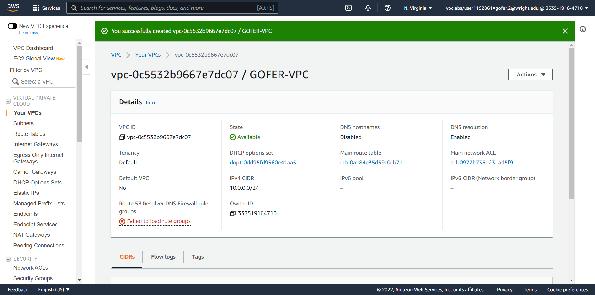
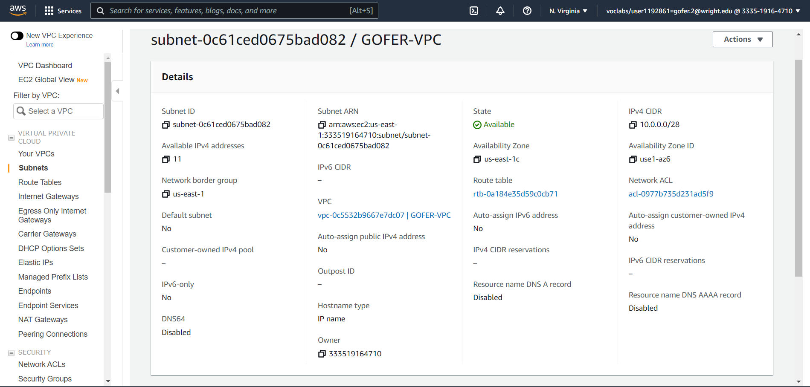
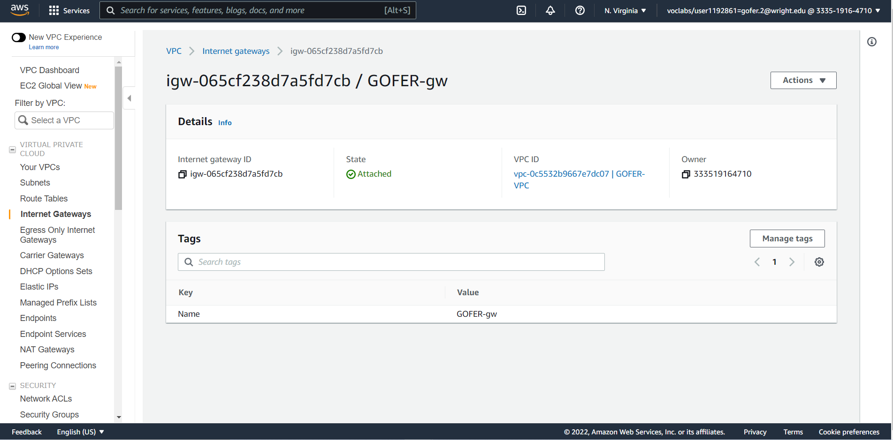
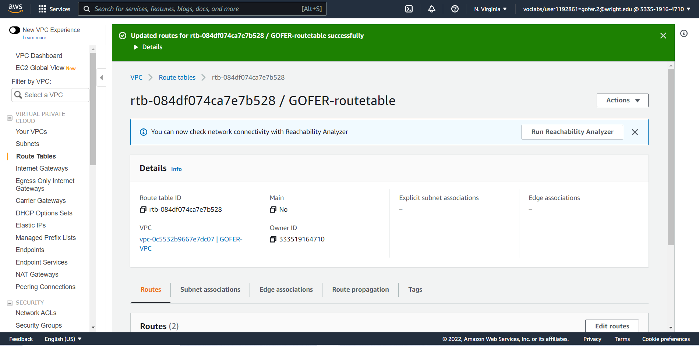
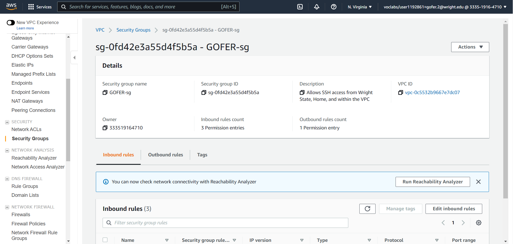
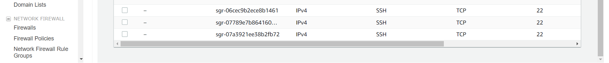
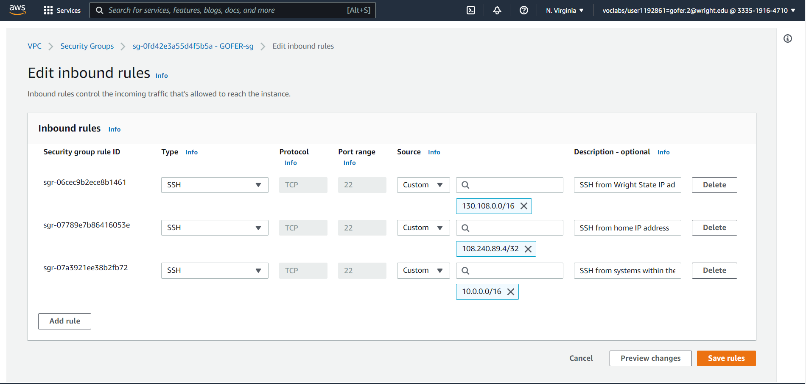
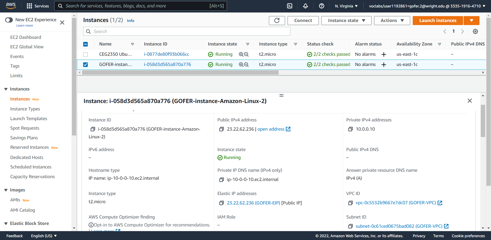
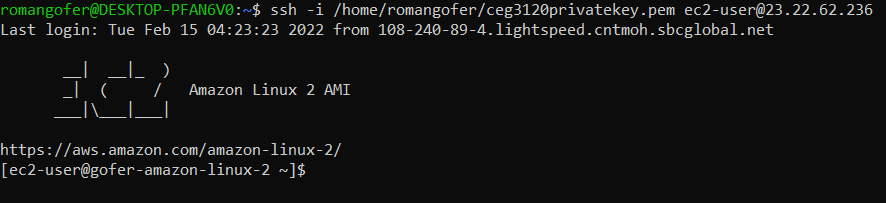

# CEG 3120 Project 2 Documentation

## 1. VPC Creation

A VPC is a virtual private cloud that I created with my AWS funds. This is tied to my own AWS account and hosted with AWS cloud 
networking services. In summary, I am using my credits from AWS to create a network hosted in the cloud with AWS's resources that I will be able to connect to.

## 2. Subnet Creation

This is a type of organization for my VPC and networks in general. Also, a subnet can act as a barrier between devices, so if 
someone constructing a network wanted to section off certain devices and keep them separate for security reasons, they could use this to allocate IP addresses.

## 3. Internet Gateway Creation

An internet gateway is a device used to connect to the internet. This is what the cable people install when they go to someone's house to install internet service. This box that is installed connects to the internet network and brings the connection into the building or home. In the case of AWS and this project, this is in a virtual form. What happens with this is it is created virtually on AWS, and then it is "plugged in" to the VPC when the VPC is attached on the website. The VPC is the virtual equivalent of a building or house. With this gateway, I will now be able to make a connection to it from my system.

## 4. Route Table Creation

Route tables act as routers. They look at the location to which packets are addressed and send them to where they need to go. Also, this table needs to be told the routes for traffic traveling inside the subnet (devices connected to my virtual network) and the routes for traffic traveling to the internet outside my network. When this was created, it automatically came with a rule that specified the route for local traffic, and then the one for outside traffic, I added in a rule with the `0.0.0.0/0` destination specification to allow any traffic. Also, I had to choose my internet gateway that I created as the target that receives traffic to all destinations and lets them out into the internet.

## 5. Security Group Creation

Security groups serve as the firewall for the VPC. This is where rules are set for specific traffic. To be able to `ssh` into the instance, there will need to be a specific rule that allows inbound SSH traffic into the instance. Also, the specific IP addresses from which to allow inbound SSH traffic need to be set. In my case, I need to set an SSH acceptance rule for `130.108.0.0/16`. Since Wright State owns all `130.108` IP addresses, this will allow me to `ssh` in whenever I am connected to the internet at Wright State. Also, I set an acceptance rule for my IP address at home so I can `ssh` in when I am not at Wright State. The last inbound rule I set is a rule to accept SSH traffic from `10.0.0.0` IP addresses. This allows traffic to come in locally from systems inside my VPC. For the outbound rules, this is just set to `0.0.0.0/0` to allow all traffic. With AWS, there is no way to block certain services, the rules can only allow traffic. As a result, it would be difficult to block just a few sources of traffic, since a long list would need to be made of all the other sources of traffic that were allowed. Another important note is that the `/16` at the end of the rules to allow all IP addresses that start with a certain prefix specifies that it can be any IP address with that prefix. When allowing traffic this way, the CIDR notation suffix has to be less than `/32`.

Separate screenshot to show specific IP addresses:

## Part 2 - EC2 Instances

1. AMI selected: Amazon Linux 2
    - Default username for this AMI: `ec2-user`
    - Instance type selected: `t2.micro` (free tier eligible)
2. I attached my VPC to my instance by selecting it when going through the steps of creating the instance after I clicked the orange "create instance" button.
3. I disabled this feature because I want to make sure my IP address is not auto-released and reassigned when I am using my instance. It seems more convenient to just be able to keep the same IP address so I don't have to sign in and periodically have to check to see if my instance has a new IP address.
4. I also attached a volume by selecting it during the instance creation process.
5. After completing the previous step and clicking "next," I clicked "add tag" and typed "Name" in the left box and then my tag name, which is "GOFER-instance-Amazon-Linux-2".
6. To associate my security group with my instance, I just selected the one from the list that I tagged with my last name. This selection screen came up as I was going through the setup process for the instance.
7. To allocate the IP address, I viewed my instances in the EC2 home screen after finishing the setup process, and I checkmarked my new instance I created. After this, on the lefthand side, I clicked on `Elastic IPs`. After this, I made sure my instance was still checkmarked, and then I clicked the orange "allocate" button on the upper-right side. Then, I scrolled down and clicked "add tag" and typed in the tag information. Once this was finished, I clicked "allocate," and then the IP address was successfully allocated. To associate it with my instance, I clicked the "Associate this Elastic IP Address" button in the green banner at the top that appeared after the IP was successfully allocated. After this, I answered all the settings it asked me to choose and clicked "associate."
8. Screenshot of my newly-created instance:

9. To change the hostname of my instance, I edited the `/etc/hostname` file, and I made a copy of it before editing. Then, I changed the contents from the default hostname to my new `gofer-amazon-linux-2` name. This did not work on my instance, so I ran `sudo hostnamectl set-hostname Gofer-Amazon-Linux-2` instead, and this ended up working. After this, I just `exit`ed out of my instance and `ssh`ed back in, and then my new hostname started to be displayed instead of the default.
10. 

