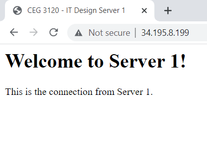
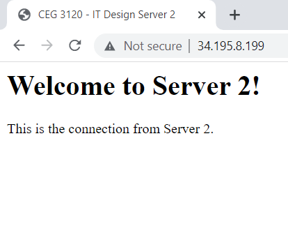

# Documentation for Part 2

1. I created a `.ssh/config` file on each system to correlate hostnames to private IPs.
         - To setup this file, I `cd`'ed into the .ssh directory and created a file called `config`.
         - Then, I typed these contents into the file:

                        ```
                Host webserver1

                        HostName 10.0.1.10
                        User ubuntu
                        IdentityFile ceg3120privatekey.pem

                Host proxy

                     HostName 10.0.0.10
                     User ubuntu
                     IdentityFile ceg3120privatekey.pem

                         ```

    - Depending on which system's file I was working on, I changed what went next to host as well as the private IP. For example, this file in the proxy has `webserver1` and `webserver2` listed next to host and their private IPs for the "HostName" since those were the other systems I will need to connect to from the proxy.
    - The name typed next to "Host" at the top of each entry is what will be used with the `ssh` command instead of typing in this: `ssh -i /path/to/private/key ubuntu@ip-address`. In the case of the contents above, `ssh webserver1` would be run instead of `ssh -i ceg3120privatekey.pem ubuntu@10.0.1.10`.
    - "HostName" is what IP address will be tied to the name typed next to "Host". This way, the system knows which IP address to use when it receives that specific host name.
    - "User" is the default username for the instance, which is `ubuntu` for all the instances in this project.
    - "IdentityFile" is where the relative path for the system's private key goes.
2. When this `config` file is properly setup on all systems, all that needs to be typed to `ssh` in between the systems is `ssh insert-system-host-name-here`. No private key, username, or IP address specifications are required anymore since they are now entered into the `config` file.
3. To set up a HAProxy load balancer, the configuration file for HAProxy's settings had to be changed, and some new configuration settings were added.
           - The `haproxy.cfg` file, which was located inside of `/etc/haproxy`, was modified.
           - Configurations that were set: frontend and backend parts of the `haproxy.cfg` file, frontend is where the proxy server was specified as well as its public IP address and its private IP address. In the frontend section, the `default_backend` was specified so the system knew about the two backend servers.
           - In backend, the load balancing algorithm was specified, which was roundrobin. This is what allows content from server 1 to be displayed sometimes and content from server 2 to be displayed sometimes when the proxy server is connected to. The other important item in the backend section of the `haproxy.cfg` file are the `server` lines. This is where the names of the backend servers, their private IPs, and the ports for them to serve content over (80) were specified.
           - To restart HAProxy after a configuration change: `sudo systemctl restart haproxy`
           - Resources used: 
           - [HAProxy Setup Article 1 Given in the Directions](https://www.haproxy.com/blog/the-four-essential-sections-of-an-haproxy-configuration/)
           - [HAProxy Setup Article 2 Given in the Directions](https://www.digitalocean.com/community/tutorials/an-introduction-to-haproxy-and-load-balancing-concepts)
           - In-class lectures
4. To set up the webservers, the webserver software had to be installed on the two backend servers. I chose to install apache on my servers.
           - To allow the webserver to display the desired content, the `index.html` file located in `/var/www/html` had to be modified. Also, the `000-default.conf` file inside of `/etc/apache2/sites-enabled` could be modified for Apache to look in a different directory for `index.html`, but this was not necessary for me since I was using the default location. Also, this file could be modified to give the system permission to read the whole directory it is set to point to, since by default it is only allowed to read the `index.html` file. This was not necessary for me to get my server/websites working either.
           - By default, there was code in that `index.html` file that was just a default page that had information about Apache and how the `index.html` file setup worked. After making a backup copy of the original file, I copied and pasted in my own HTML code to display into the file on both backend servers.
           - Site content files were located in `/var/www/html` because that is where Apache looks by default for the index.html file to display.
           - To restart the service after a configuration change: `sudo systemctl restart apache2`
           - Resources used:
           - [Apache Article from Directions](https://www.digitalocean.com/community/tutorials/how-to-install-the-apache-web-server-on-ubuntu-20-04)
           - In-class lectures
5. Proxy server connection screenshots:
        - Server 1 screenshot:
        
        - Server 2 screenshot:
        
6. Link to my proxy: http://34.195.8.199/